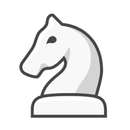

# Chess Extension

<div align="center">  <h1 style="font-size:30px" >Chess analysis extension <br />
 </h1>  </div>
<p align="center"> A simple chess analysis web application using Stockfish chess engine.
</p>

[](https://opensource.org/licenses/MIT)
[](https://www.docker.com/)
[](https://www.python.org/)
[](https://flask.palletsprojects.com/en/1.1.x/)
[](https://stockfishchess.org/)

## Table of Contents

- [Introduction](#introduction)
- [Prerequisites](#prerequisites)
- [Installation](#installation)
- [Requirements](#requirements)
- [Configuration](#configuration)
- [Usage](#usage)
  - [Endpoints](#endpoints)
- [Docker](#docker)
- [Example](#example)
- [License](#license)
- [Authors](#authors)
- [Acknowledgments](#acknowledgments)

## Introduction

This is a simple Flask web application for analyzing chess moves using the Stockfish chess engine. It provides two endpoints for analyzing chess moves: one for analyzing all moves in a game and another for analyzing a single move.

## Prerequisites

Before running the application, make sure you have the following installed:

- Python 3
- Flask
- Stockfish chess engine
- [config.ini](config.ini) file with the required configuration (see [Configuration](#configuration))
- [dummy.json](dummy.json) file with dummy data for testing (see [Example](#example))
- You can use Docker to run the application (see [Docker](#docker))

## Installation

1. Clone this repository to your local machine:

```bash
    git clone https://github.com/meteor314/chess-extension
    cd chess-extension
```

2. Install the required dependencies:

```bash
    cd server &&  pip install -r requirements.txt
```

> Note: It is recommended to use Docker to run the application. See [Docker](#docker) for more details.

## Requirements

You need to have the following installed on your machine:

- Python 3
- Flask
- Stockfish chess engine `sudo apt install stockfish`

## Configuration

Create a config.ini file in the project directory with the following format:

```ini
[STOCKFISH]
path = /usr/games/stockfish     # Path to the Stockfish binary
threads = 10                  # Number of threads to use
min_thinking_time = 30      # Minimum thinking time in milliseconds
```

## Usage

The web application will be available at http://localhost:5000.

### Endpoints

1. Analyze All Moves

   - URL: /analysis-all-moves

   - Method: POST

   - `Input`: JSON array of moves in the following format:

```js
[
  {
    whiteMove: "e4",
    blackMove: "e5",
  },
  {
    whiteMove: "Nf3",
    blackMove: "Nc6",
  },
  // etc..
];
```

`Output`: JSON response with analysis results for all moves:

```js
{
  "result": [
    {
      "best_move": "e5",
      "analysis": {
        "type": "cp",
        "value": 10
      }
    },
    {
      "best_move": "Nc6",
      "analysis": {
        "type": "cp",
        "value": -10
      }
    },
    // Analysis results for each move
  ],
  "time": 2.345  // Total processing time in seconds
}
```

2. Analyze One Move

   - URL: /analysis-one-move
   - Method: POST
   - `Input`: JSON object representing a single move in the following format:

```js
{
  "fen": "rnbqkbnr/pppp1ppp/8/4p3/4P3/8/PPPP1PPP/RNBQKBNR w KQkq - 0 2"
}
```

`Output` : JSON response with analysis result for the given move:

```js
{
  "best_move": "Nf3",
  "analysis": {
    "type": "cp",
    "value": 20
  },
  "fen": "rnbqkbnr/pppp1ppp/8/4p3/4P3/5N2/PPPP1PPP/RNBQKB1R b KQkq - 1 2",
  "time": 1.234  // Processing time in seconds
}
```

## Docker

To run the application using Docker, you can use the following Dockerfile

```sh
    cd server
    docker build -t chess-extension .
    docker run -p 5000:5000 chess-extension
```

## Example

You can use the provided dummy.json file to test the application by running the following command:

```bash
    curl -X POST -H "Content-Type: application/json" -d @dummy.json http://localhost:5000/analysis-all-moves
```

## License

This project is licensed under the MIT License - see the LICENSE file for details.

## Authors

@meteor314

## Acknowledgments

- [Flask](https://flask.palletsprojects.com/en/1.1.x/)
- [Stockfish](https://stockfishchess.org/)
